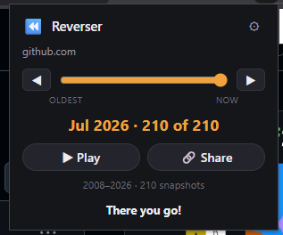
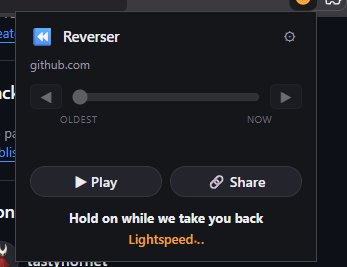
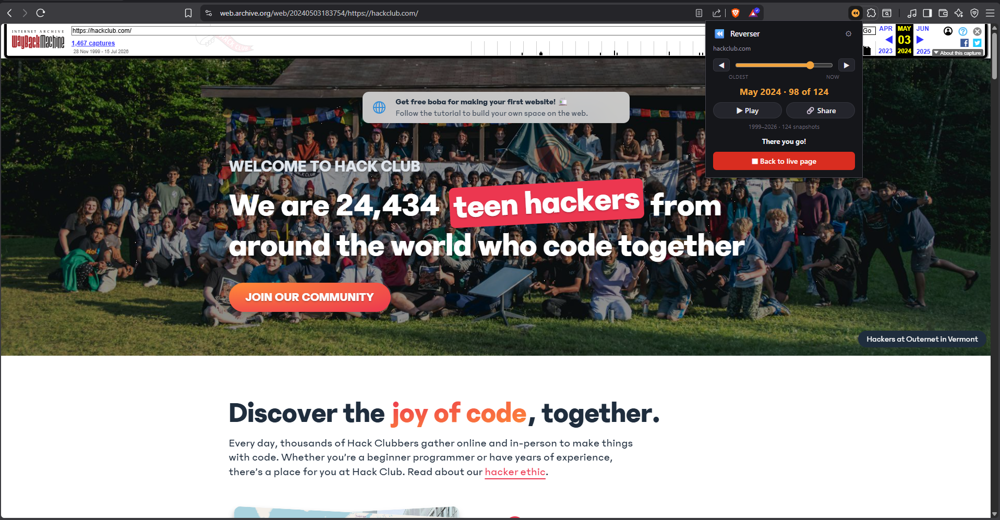

# Reverser

Reverser grabs every saved snapshot of the current site from the Wayback Machine, lines them up on a slider right in the toolbar popup, and as you drag it sends the actual tab back in time. Today, last year, ten years ago, one drag away.

## How to use it

Open any site, click the Reverser icon, and a slider appears in the popup with every monthly snapshot the archive has. Drag it, or step one at a time with ◀ ▶, and the tab reloads as that archived version. The date you're on shows right under the slider. Done looking? Hit "Back to live page" and the tab returns to the present-day site.

Keep the popup open while you scrub, it stays put as the tab reloads underneath it. And don't expect it to be instant, each date is a fresh pull from archive.org and that's not a fast server, so give every jump a second. The popup tells you it's working on it:

### How hackclub looked six years ago

This is what it actually looks like. Here's hackclub.com sitting on a May 2024 capture, snapshot 98 of 124:

Now drag the slider left to April 2018 and the same tab, same URL, turns into this:

## How it works

Short version: it asks archive.org what it has, then sends your tab there. The longer version has a few more moving parts than you'd guess.

**Working out what you're even looking at.** The popup reads the active tab and first decides whether the page is reversible at all - http/https only, so `chrome://`, `file://` and new-tab pages get turned away before anything else happens. If you're already sitting on an archived page, it unwraps the original URL back out of the Wayback path (`/web/<timestamp>/<real-url>`, sometimes with an `if_`-style modifier wedged in the middle) so the slider keeps working instead of trying to archive the archive. It pulls the timestamp out of that URL too, and lines the slider thumb up with the snapshot you're already on.

**Finding the snapshots.** Session cache first: if you've looked this site up since the browser started, the list comes straight back and the popup opens instantly. Otherwise it hits the CDX API, asking for captures of the exact URL, filtered to `statuscode:200` so dead pages and redirects don't become slider stops, collapsed to `timestamp:6` for one capture per year-month, and capped at 1000 rows so a heavily-crawled site can't flood the popup. If the exact URL comes back empty - deep links often aren't captured even when the site itself has twenty years of history - it falls back to the homepage and tries again.

**When CDX gives up.** Ask CDX for every capture of something like google.com and it will cheerfully time out, or hand back an HTML error page instead of JSON. So the reply gets checked properly: status code, content type, and a real `JSON.parse` guard, with the raw body dumped to the console when it isn't what it should be. If that whole path fails, Reverser drops to a completely different API - the availability index, which is a lookup rather than a scan and stays fast on enormous sites. It samples one capture per year from 1996 to now, six lookups in flight at a time so archive.org doesn't rate-limit it, then dedupes what comes back down to one per year-month and rebuilds a usable timeline out of the survivors.

**Actually moving the tab.** Dragging calls `chrome.tabs.update` on `https://web.archive.org/web/<timestamp>/<your-url>`, debounced by 300ms so a quick drag across twenty years is one page load instead of twenty. It's a normal navigation, so the archived page renders natively. The loading panel then waits for a `tabs.onUpdated` "complete" event for that specific tab, with a timeout backstop behind it - archived pages firing their original, now-dead API calls can otherwise keep a tab "loading" forever.

## Extras

Beyond the core slider, the toolbar popup now carries a few more things:

- **Play through time (a bit buggy)** - hit ▶ (or space) and the slider walks itself forward one snapshot at a time so you can watch a site age on its own. Speed and looping live in settings.
- **Share this moment** - 🔗 copies the archive.org link for the snapshot you're currently on, so you can paste the exact then-and-there page to someone.
- **Keyboard scrubbing** - ←/→ step, Home/End jump to the oldest/newest, space toggles play, Esc drops back to live.
- **Recently reversed** - the ⚙ panel keeps a short list of sites you've time-travelled, one click to reopen.
- **Settings (⚙)** - theme (dark / light / auto), autoplay speed + loop, a confirm prompt before leaving the archive, history on/off, a stats footer toggle, and verbose console logging.
- **Stats footer** - a one-line "1998–2024 · 240 snapshots" summary of the timeline you're scrubbing.

## Loading it

1. Open chrome://extensions (or edge://extensions).
2. Turn on Developer mode.
3. Load unpacked, and pick the Reverser folder.
